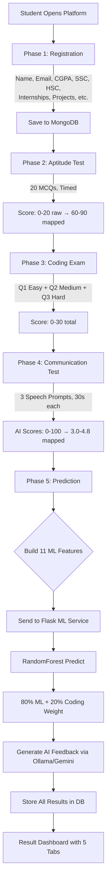

# 🎓 AI-Powered Placement Readiness Prediction Platform

> A full-stack, AI-driven system that evaluates engineering students across **aptitude, coding, and communication** — then predicts their placement probability using a trained **Random Forest ML model** with personalized career guidance powered by **Ollama/Gemini AI**.

---

## 📑 Table of Contents

- [Problem Statement](#-problem-statement)
- [Solution Overview](#-solution-overview)
- [Tech Stack](#-tech-stack)
- [Architecture](#-architecture)
- [System Flow](#-system-flow)
- [Features](#-features)
- [ML Model](#-ml-model)
- [Project Structure](#-project-structure)
- [API Reference](#-api-reference)
- [Database Schema](#-database-schema)
- [Score Mapping Logic](#-score-mapping-logic)
- [AI Feedback System](#-ai-feedback-system)
- [Setup & Installation](#-setup--installation)
- [How We Solved It](#-how-we-solved-it)

---

## 🎯 Problem Statement

Every year, nearly **40% of engineering graduates remain unplaced** — not because they lack talent, but because they don't know their weak areas in time. Colleges lack a standardized tool to evaluate students holistically across aptitude, coding ability, and communication skills together.

**Our platform** gives students a **real-time, AI-driven placement readiness score** with actionable feedback — so they can improve *before* placements begin.

---

## 💡 Solution Overview

A 5-phase evaluation platform that:

1. Collects student academic and experience data
2. Tests aptitude with 20 MCQs (timed, randomized)
3. Tests coding with 3 difficulty-graded problems (Easy → Medium → Hard)
4. Evaluates communication via speech-to-text + AI scoring
5. Predicts placement probability using ML + provides comprehensive AI career guidance

---

## 🛠 Tech Stack

| Layer | Technology | Purpose |
|-------|-----------|---------|
| **Frontend** | React 19 + Vite 8 | SPA with multi-phase evaluation UI |
| **Styling** | Vanilla CSS | Custom design system with animations |
| **Code Editor** | Monaco Editor | VS Code-like in-browser coding IDE |
| **Backend** | Node.js + Express.js | REST API, business logic, code execution |
| **Database** | MongoDB + Mongoose | Student records, questions, submissions |
| **ML Service** | Python Flask | Serves trained sklearn model for predictions |
| **ML Model** | scikit-learn RandomForest | Placement prediction (11 features) |
| **AI Feedback** | Ollama (local) / Google Gemini 2.0 | Communication scoring + career guidance |
| **Speech** | Web Speech Recognition API | Browser-native speech-to-text |
| **Code Execution** | Node.js child_process | Local sandboxed execution (Python, JS, Java, C++) |

---

## 🏗 Architecture

```
┌─────────────────────────────────────────────────────────────────────┐
│                        FRONTEND (React + Vite)                      │
│  ┌──────────┐ ┌──────────┐ ┌──────────┐ ┌──────────┐ ┌──────────┐  │
│  │ Register │→│ Aptitude │→│  Coding  │→│  Comms   │→│  Result  │  │
│  │  Page    │ │  Test    │ │  Exam    │ │  Test    │ │Dashboard │  │
│  └──────────┘ └──────────┘ └──────────┘ └──────────┘ └──────────┘  │
│       │            │            │            │            │          │
└───────┼────────────┼────────────┼────────────┼────────────┼──────────┘
        │            │            │            │            │
        ▼            ▼            ▼            ▼            ▼
┌─────────────────────────────────────────────────────────────────────┐
│                    BACKEND (Node.js + Express)                      │
│                                                                     │
│  ┌────────────┐ ┌────────────┐ ┌────────────┐ ┌────────────────┐   │
│  │ /api/      │ │ /api/      │ │ /api/      │ │ /api/          │   │
│  │ students   │ │ aptitude   │ │ coding     │ │ communication  │   │
│  │            │ │            │ │            │ │                │   │
│  │ Register   │ │ 20 MCQs    │ │ 3 Problems │ │ 3 Speech       │   │
│  │ Profile    │ │ Score Map  │ │ Judge (local)│ │ Prompts       │   │
│  └────────────┘ └────────────┘ └────────────┘ └───────┬────────┘   │
│                                                       │             │
│  ┌────────────────────────────────────────────────────┐│             │
│  │              /api/predict                          ││             │
│  │  ┌──────────────────┐  ┌────────────────────────┐ ││             │
│  │  │ buildMLFeatures  │  │ 80/20 Weighted         │ ││             │
│  │  │ (11 features)    │→ │ Prediction             │ ││             │
│  │  └──────────────────┘  └────────────────────────┘ ││             │
│  └─────────┬──────────────────────────┬───────────────┘│             │
│            │                          │                │             │
└────────────┼──────────────────────────┼────────────────┼─────────────┘
             │                          │                │
             ▼                          ▼                ▼
┌─────────────────┐   ┌────────────────────┐   ┌──────────────────┐
│  FLASK ML       │   │  OLLAMA / GEMINI   │   │    MONGODB       │
│  SERVICE        │   │  AI SERVICE        │   │                  │
│                 │   │                    │   │  Students        │
│  RandomForest   │   │  Career Guidance   │   │  Questions       │
│  Pipeline       │   │  Blind Spots       │   │  Submissions     │
│  (Port 5001)    │   │  Skill Gaps        │   │  Results         │
│                 │   │  30-Day Plan       │   │  AI Feedback     │
└─────────────────┘   └────────────────────┘   └──────────────────┘
```

### Communication Flow

```
┌───────────┐     ┌──────────┐     ┌──────────────┐     ┌──────────┐
│  Browser  │────→│  Express │────→│   Ollama/    │────→│  MongoDB │
│  Speech   │ API │  Backend │ AI  │   Gemini     │     │  Store   │
│  to Text  │     │          │     │   Scoring    │     │          │
└───────────┘     └──────────┘     └──────────────┘     └──────────┘
```

---

## 🔄 System Flow



### Phase Locking

Each phase **must be completed** before the next unlocks:

| Phase | Gate | Saves to DB |
|-------|------|-------------|
| 1. Register | currentPhase → 2 | Profile data (8 fields) |
| 2. Aptitude | currentPhase → 3 | aptitudeRawScore, aptitudeTestScore |
| 3. Coding | currentPhase → 4 | codingQ1Score, codingQ2Score, codingQ3Score, codingTotalScore |
| 4. Communication | currentPhase → 5 | communicationRawScores, softSkillsRating |
| 5. Result | predictionCompletedAt | mlProbability, mlPrediction, geminiFeedbackParsed |

---

## ✨ Features

### 🧠 Aptitude Test
- **20 randomized MCQs** from a pool of 100+ questions
- Categories: Logical Reasoning, Quantitative, Verbal Ability
- Server-side scoring (answers never sent to client)
- Score mapping: Raw (0–20) → ML range (60–90)

### 💻 Coding Exam
- **3 difficulty-graded problems**: Easy (Q1), Medium (Q2), Hard (Q3)
- **Monaco Editor** (VS Code engine) with syntax highlighting
- Supports **Python, JavaScript, Java, C++**
- **Local code execution** using `child_process` (no external API)
- Public test cases for "Run" + hidden test cases for "Submit"
- Score per question: 0–10 based on hidden test case pass rate
- Total: 0–30 (10 per question)

### 🎤 Communication Assessment
- **3 speech prompts** (scenarios, comprehension, personal questions)
- 10s reading time + 30s recording via **Web Speech Recognition API**
- Real-time transcript display
- AI scoring via **Ollama/Gemini** (clarity, relevance, vocabulary, confidence)
- Score mapping: AI average (0–100) → ML range (3.0–4.8)

### 📊 ML Prediction
- **Random Forest Classifier** (200 trees, max_depth=12)
- Trained on **10,000 synthetic student records**
- **11 input features** (see table below)
- **80/20 weighted prediction**: `finalProb = 0.80 × ML_prob + 0.20 × (codingScore / 30)`
- Fallback predictor if Flask is unavailable

### 🤖 AI Career Guidance (Ollama/Gemini)
- **All raw scores** sent to AI (not just summaries)
- Blind spot detection (hidden weaknesses)
- Skill gap analysis with priority levels (Critical/High/Medium/Low)
- Career path recommendations (company tier, roles, industry fit)
- Interview readiness score (1–10) with tips
- Risk factor analysis with mitigation strategies
- Competitive advantage identification
- **30-day improvement plan** with weekly tasks and daily hours
- Feedback persists in DB across page reloads

### 📈 Result Dashboard (5 Tabs)
| Tab | Content |
|-----|---------|
| **Overview** | Probability gauge, score bars vs placed avg, coding breakdown, profile, strengths |
| **Skill Gap** | Blind spots, gap analysis with priority badges, risk factors |
| **Career Guidance** | Career paths, company tier, role recommendations, interview prep |
| **AI Feedback** | Detailed coding/communication/aptitude/academic analysis per section |
| **30-Day Plan** | Weekly focus areas with tasks and daily hour recommendations |

---

## 🤖 ML Model

### The 11 Features

| # | Feature | Type | Range | Source |
|---|---------|------|-------|--------|
| 1 | CGPA | Numerical | 6.5–9.1 | Registration form |
| 2 | Internships | Numerical | 0–2 | Registration form |
| 3 | Projects | Numerical | 0–3 | Registration form |
| 4 | Workshops/Certifications | Numerical | 0–3 | Registration form |
| 5 | AptitudeTestScore | Numerical | 60–90 | Aptitude test (mapped) |
| 6 | SoftSkillsRating | Numerical | 3.0–4.8 | Communication test (mapped) |
| 7 | ExtracurricularActivities | Categorical | Yes/No | Registration form |
| 8 | PlacementTraining | Categorical | Yes/No | Registration form |
| 9 | SSC_Marks | Numerical | 55–90 | Registration form |
| 10 | HSC_Marks | Numerical | 57–88 | Registration form |
| 11 | CodingScore | Numerical | 0–30 | Coding exam (Q1+Q2+Q3) |

### Training Pipeline

```
Data (10,000 records) → 80/20 Train-Test Split (stratified)
                           │
                           ▼
            ┌─────────────────────────────┐
            │     ColumnTransformer       │
            │  ┌───────────┐ ┌─────────┐  │
            │  │ Standard  │ │ OneHot  │  │
            │  │ Scaler    │ │ Encoder │  │
            │  │ (9 num)   │ │ (2 cat) │  │
            │  └───────────┘ └─────────┘  │
            └──────────────┬──────────────┘
                           │
                           ▼
              ┌──────────────────────┐
              │  RandomForest(200)   │
              │  max_depth=12        │
              │  class_weight=       │
              │    'balanced'        │
              └──────────────────────┘
                           │
                           ▼
                    Accuracy: ~85%+
```

### Dataset Statistics

| Feature | Placed Avg | Not-Placed Avg |
|---------|-----------|----------------|
| CGPA | 8.02 | 7.47 |
| Aptitude | 84.46 | 75.83 |
| CodingScore | 21 | 11 |
| SoftSkills | 4.53 | 4.17 |
| SSC_Marks | 74.92 | 64.99 |
| HSC_Marks | 79.81 | 70.67 |

### Weighted Prediction Formula

```
codingFactor = codingTotalScore / 30
finalProbability = 0.80 × ML_model_probability + 0.20 × codingFactor
verdict = finalProbability >= 0.5 ? "Placed" : "NotPlaced"
```

---

## 📁 Project Structure

```
placement-platform/
├── backend/                      # Node.js + Express API
│   ├── server.js                 # Express app, MongoDB connection, route mounting
│   ├── models/
│   │   ├── Student.js            # Main student schema (all phases)
│   │   ├── AptitudeQuestion.js   # MCQ question schema
│   │   ├── CodingQuestion.js     # Coding problem schema
│   │   ├── CodingSubmission.js   # Code submission records
│   │   └── CommunicationQuestion.js  # Speech prompt schema
│   ├── routes/
│   │   ├── students.js           # POST /register, GET /:id, PATCH /:id/profile
│   │   ├── aptitude.js           # GET /questions, POST /submit, GET /result
│   │   ├── coding.js             # GET /questions, POST /run, POST /submit, POST /finalize
│   │   ├── communication.js      # GET /questions, POST /evaluate
│   │   └── predict.js            # GET /:studentId (stored), POST /:studentId (run prediction)
│   ├── utils/
│   │   ├── scoreMapper.js        # mapAptitudeScore(), mapSoftSkillsRating(), buildMLFeatureVector()
│   │   └── judge0.js             # Local code execution engine (runs code via child_process)
│   ├── seeds/
│   │   ├── seedAll.js            # Run all seeders
│   │   ├── seedAptitude.js       # 100+ aptitude MCQs
│   │   ├── seedCoding.js         # Coding problems (Easy, Medium, Hard)
│   │   └── seedCommunication.js  # Communication prompts
│   ├── .env                      # MONGODB_URI, GEMINI_API_KEY, OLLAMA_URL
│   └── package.json
│
├── frontend/                     # React 19 + Vite 8 SPA
│   ├── src/
│   │   ├── App.jsx               # React Router (6 routes)
│   │   ├── main.jsx              # Entry point
│   │   ├── index.css             # Full design system (CSS custom properties)
│   │   ├── pages/
│   │   │   ├── Landing.jsx       # Hero page
│   │   │   ├── Register.jsx      # Student registration form
│   │   │   ├── Aptitude.jsx      # MCQ test UI with timer
│   │   │   ├── Coding.jsx        # Monaco editor + test runner
│   │   │   ├── Communication.jsx # Speech recording UI
│   │   │   └── Result.jsx        # 5-tab result dashboard
│   │   ├── utils/
│   │   │   └── api.js            # API client (all endpoints)
│   │   └── hooks/                # Custom React hooks
│   └── package.json
│
├── ml_service/                   # Python Flask ML service
│   ├── app.py                    # Flask server (port 5001), /predict endpoint
│   ├── train_model.py            # Train RandomForest pipeline, save model
│   ├── generate_dataset.py       # Generate 10,000 synthetic student records
│   ├── placementdata.csv         # Training dataset (10,000 rows, 12 columns)
│   ├── trained_pipeline_model.joblib  # Serialized sklearn pipeline
│   ├── label_encoder.joblib      # Serialized label encoder
│   ├── model.pkl                 # Legacy model file
│   └── requirements.txt          # Python dependencies
│
├── doc.md                        # Demo Q&A preparation document
└── README.md                     # ← This file
```

---

## 🔌 API Reference

### Students

| Method | Endpoint | Description |
|--------|----------|-------------|
| `POST` | `/api/students/register` | Register new student with profile data |
| `GET` | `/api/students/:id` | Get student by ID |
| `PATCH` | `/api/students/:id/profile` | Update student profile |
| `GET` | `/api/students/:id/phase` | Get current phase |

### Aptitude

| Method | Endpoint | Description |
|--------|----------|-------------|
| `GET` | `/api/aptitude/questions?studentId=xxx` | Get 20 random MCQs |
| `POST` | `/api/aptitude/submit` | Submit 20 answers, get scored |
| `GET` | `/api/aptitude/result?studentId=xxx` | Get stored aptitude result |

### Coding

| Method | Endpoint | Description |
|--------|----------|-------------|
| `GET` | `/api/coding/questions?studentId=xxx` | Get 3 assigned problems (Easy/Medium/Hard) |
| `POST` | `/api/coding/run` | Run code against public test cases |
| `POST` | `/api/coding/submit` | Submit code against hidden test cases (scores 0–10) |
| `POST` | `/api/coding/finalize` | Sum all question scores → codingTotalScore |

### Communication

| Method | Endpoint | Description |
|--------|----------|-------------|
| `GET` | `/api/communication/questions?studentId=xxx` | Get 3 speech prompts |
| `POST` | `/api/communication/evaluate` | Send speech transcripts for AI scoring |

### Prediction

| Method | Endpoint | Description |
|--------|----------|-------------|
| `GET` | `/api/predict/:studentId` | Get stored prediction result (persisted) |
| `POST` | `/api/predict/:studentId` | Run ML prediction + generate AI feedback |

---

## 🗄 Database Schema

### Student Document

```javascript
{
  // Identity
  name, email, rollNumber,

  // Phase 1 — Profile (8 fields → ML features)
  cgpa, internships, projects, workshopsCertifications,
  extracurricularActivities, placementTraining, sscMarks, hscMarks,

  // Phase 2 — Aptitude
  aptitudeRawScore,       // 0–20 (correct answers)
  aptitudeTestScore,      // 60–90 (mapped for ML)

  // Phase 3 — Coding
  codingQ1Score,          // 0–10 (Easy)
  codingQ2Score,          // 0–10 (Medium)
  codingQ3Score,          // 0–10 (Hard)
  codingTotalScore,       // 0–30 (sum)

  // Phase 4 — Communication
  communicationRawScores, // [score1, score2, score3] from AI
  softSkillsRating,       // 3.0–4.8 (mapped for ML)

  // Phase 5 — Results
  mlProbability,          // Weighted: 80% ML + 20% coding
  mlPrediction,           // "Placed" or "NotPlaced"
  mlRawProbability,       // Raw ML model probability (before weighting)
  mlRawPrediction,        // Raw ML verdict
  geminiFeedbackParsed,   // Full AI feedback JSON (persisted)
  predictionCompletedAt,  // Timestamp

  // Flow control
  currentPhase            // 1–5 (gates progression)
}
```

---

## 📐 Score Mapping Logic

### Aptitude: Raw → ML Range

```
mapped = 60 + (rawCorrect / 20) × 30
Range: 0/20 → 60, 20/20 → 90
```

### Communication: AI Score → ML Range

```
mapped = 3.0 + (aiAverageScore / 100) × 1.8
Range: 0/100 → 3.0, 100/100 → 4.8
```

### Coding: Direct Mapping

```
codingTotalScore = Q1 (0–10) + Q2 (0–10) + Q3 (0–10)
Range: 0–30 (no transformation needed)
```

---

## 🤖 AI Feedback System

### Two-Tier Fallback

```
Priority 1: Ollama (local, no rate limits, llama3:8b)
    ↓ if unavailable
Priority 2: Google Gemini 2.0 Flash API
    ↓ if unavailable
Priority 3: Null feedback (prediction still works, just no AI report)
```

### Data Sent to AI

The AI receives **ALL raw data** for comprehensive analysis:
- All 11 ML features with placed/not-placed averages for comparison
- Individual coding scores (Q1/Q2/Q3) with difficulty-level analysis
- Communication raw scores array
- Both raw ML probability and weighted probability
- Coding factor percentage

### AI Feedback Structure

```
├── overallSummary          — 3-4 sentences with numbers
├── prediction              — probability, verdict, explanation
├── strengths               — top strengths with scores
├── blindSpots              — hidden weaknesses + impact + fix
├── skillGapAnalysis        — per-skill gap with priority and resources
├── areasOfImprovement      — current vs target with action plans
├── codingFeedback          — per-difficulty analysis + DSA topics + practice plan
├── communicationFeedback   — overall + interview readiness + tips
├── aptitudeFeedback        — accuracy + weak areas + resources
├── academicFeedback        — CGPA analysis + SSC→HSC→CGPA trend
├── careerGuidance          — paths, company tier, roles, industry fit
├── interviewPrep           — readiness score + technical/HR tips + mistakes
├── riskFactors             — severity + mitigation
├── competitiveAdvantage    — unique strengths + differentiators
├── thirtyDayPlan           — 4 weeks with focus, tasks, daily hours
└── motivationalClose       — personalized encouragement
```

---

## 🚀 Setup & Installation

### Prerequisites

- **Node.js** v18+
- **Python** 3.10+
- **MongoDB** (local or Atlas)
- **Ollama** with `llama3:8b` model (optional, for local AI)
- **Google Gemini API Key** (optional, for cloud AI)

### 1. Clone & Setup Backend

```bash
cd backend
npm install
```

Create `.env` file:
```env
MONGODB_URI=mongodb://localhost:27017/placement-platform
GEMINI_API_KEY=your_gemini_api_key_here
OLLAMA_URL=http://localhost:11434
OLLAMA_MODEL=llama3:8b
PORT=5000
```

Seed the database:
```bash
npm run seed
```

Start the backend:
```bash
npm start
```

### 2. Setup ML Service

```bash
cd ml_service
pip install -r requirements.txt
```

(Optional) Retrain the model:
```bash
python generate_dataset.py
python train_model.py
```

Start Flask:
```bash
python app.py
```

### 3. Setup Frontend

```bash
cd frontend
npm install
npm run dev
```

### 4. Access

Open `http://localhost:5173` in your browser.

---

## 🧩 How We Solved It

### Challenge 1: Holistic Student Evaluation

**Problem:** Existing platforms only test one skill (coding OR aptitude). No integration.

**Solution:** We built a 5-phase pipeline where each phase tests a different competency, and all results feed into a single ML model for a unified prediction. The platform enforces sequential progression — students can't skip ahead.

### Challenge 2: Code Execution Without External APIs

**Problem:** Judge0 and similar APIs have rate limits, costs, and require internet.

**Solution:** We built a **local code execution engine** using Node.js `child_process`. It creates temporary files, compiles (for Java/C++), runs with stdin input, captures stdout, and compares against expected output. 5-second timeout prevents infinite loops. Works completely offline.

### Challenge 3: Communication Assessment at Scale

**Problem:** Evaluating speech/communication usually requires human evaluators — expensive and slow.

**Solution:** We use the **Web Speech Recognition API** (native browser) to convert speech to text in real-time, then send transcripts to **Ollama/Gemini AI** for automated scoring on clarity, relevance, vocabulary, and confidence. No human evaluators needed.

### Challenge 4: Making Predictions Actionable

**Problem:** Most ML models just output "Placed/Not Placed" — students don't know what to improve.

**Solution:** We go beyond binary classification:
- **80/20 weighted probability** (not just raw ML output)
- **Comprehensive AI feedback** with blind spots, skill gaps, career paths
- **30-day improvement plan** with weekly tasks
- **Comparison against placed averages** for every metric
- Everything **persists in DB** — reload the page and feedback is instantly there

### Challenge 5: Graceful Degradation

**Problem:** External services (Ollama, Gemini, Flask) may be unavailable.

**Solution:** Multi-tier fallback at every level:
- ML Prediction: Flask → Node.js fallback predictor
- AI Feedback: Ollama → Gemini → null (prediction still works)
- Communication scoring: AI → default score
- Results: API → cached DB results → student record

### Challenge 6: Feature Engineering

**Problem:** Raw test scores have different scales (0–20 aptitude, 0–100 communication, 0–30 coding).

**Solution:** Score mapping functions normalize everything to the ranges the ML model was trained on:
- Aptitude: 0–20 → 60–90
- Communication: 0–100 → 3.0–4.8
- Coding: 0–30 (direct, no mapping needed)

All mapping is done server-side in `scoreMapper.js` before features reach the model.

---

## 📜 License

This project was built as an academic project for placement readiness evaluation.

---

> **Built with ❤️ using React, Node.js, Flask, scikit-learn, and Ollama/Gemini AI**
